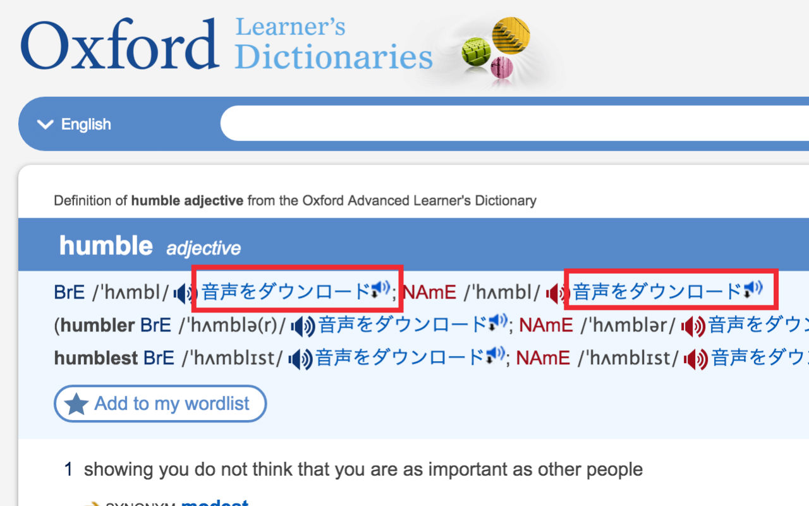

# Fetch Audio of Online Dictionaries

## What is this

This Chrome Exthension adds links to download audio for serveral on-line dictionaries.

**Please note that the copyright of the audio clips belong to their original owners.**

## Current Supported Sites

- 台灣雅虎奇摩字典 [http://tw.dictionary.yahoo.com/](http://tw.dictionary.yahoo.com/)
- Oxford Learners Dictionaries [http://www.oxfordlearnersdictionaries.com/](http://www.oxfordlearnersdictionaries.com/)

## Add a New Site

- Find a new site which is not yet being supported.
- Add its audio distraction rules to `content_scripts.js`.
- Add the site's name to `textSupportedSitesLists` in `_locales\en\messages.json`.
- Add the site's name to `README.md`.
- Commit.

## Todo Sites

- http://ejje.weblio.jp/content/%E5%BF%83
- http://jisho.org/search/%E3%81%93%E3%81%93%E3%82%8D
- http://nihongo.monash.edu/cgi-bin/wwwjdic?1E

## License

This project is licensed under the terms of the [MIT license](http://opensource.org/licenses/MIT).

This project uses:

- [jQuery](https://jquery.com/)
- Audio icon made by [Freepik](http://www.freepik.com) from [www.flaticon.com](http://www.flaticon.com), licensed under [CC BY 3.0](http://creativecommons.org/licenses/by/3.0/)
- Download icon made by [Google](http://www.google.com) from [www.flaticon.com](http://www.flaticon.com), licensed under [CC BY 3.0](http://creativecommons.org/licenses/by/3.0/)
