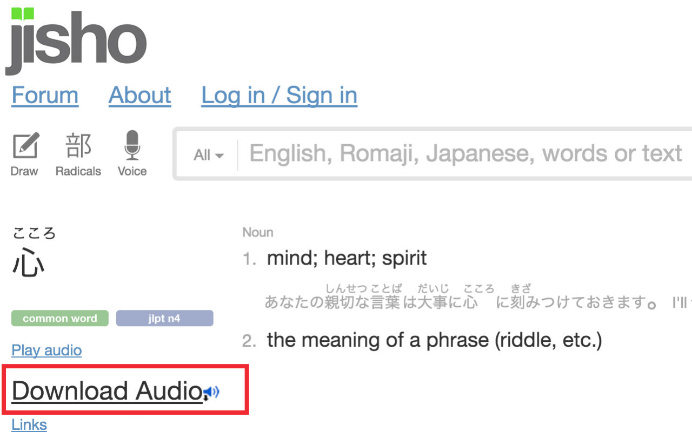

# Fetch Audio of Online Dictionaries

## What is this

This Chrome Exthension adds links to download audio for serveral on-line dictionaries.

**Please note that the copyright of the audio clips belong to their original owners.**

## Supported Online Dictionaries

- (English) 台灣雅虎奇摩字典 [http://tw.dictionary.yahoo.com/](http://tw.dictionary.yahoo.com/)
- (English) Oxford Learners Dictionaries [http://www.oxfordlearnersdictionaries.com/](http://www.oxfordlearnersdictionaries.com/)
- (Japanese) jisho Japanese-English dictionary [http://jisho.org/](http://jisho.org/)
- (Traditional Chinese) 萌典 [https://www.moedict.tw/](https://www.moedict.tw/)
- (English) Cambridge Dictionaries online [http://dictionary.cambridge.org/](http://dictionary.cambridge.org/)
- (German/Deutsch) 德语助手 [http://www.godic.net/](http://www.godic.net/)
- (Japanese) Japanesepod101 [http://www.japanesepod101.com/](http://www.japanesepod101.com/)
- (France/French) 法语助手 [http://www.frdic.com/](http://www.frdic.com/)
- (English) Learner's Dictionary [http://www.learnersdictionary.com/](http://www.learnersdictionary.com/)
- (English) Merriam-Webster [http://www.merriam-webster.com/](http://www.merriam-webster.com/)
- (English) VoiceTube [https://tw.voicetube.com/](https://tw.voicetube.com/)
- (English) Dr.eye 譯典通 [http://yun.dreye.com/dict_new](http://yun.dreye.com/dict_new)
- (English) Vocabulary.com [https://www.vocabulary.com/](https://www.vocabulary.com/)
- (English) The Free Dictionary [http://www.thefreedictionary.com/](http://www.thefreedictionary.com/)
- (English) Quizlet [https://quizlet.com/](https://quizlet.com/)
- (English) Macmillan Dictionary [http://www.macmillandictionary.com/dictionary/](http://www.macmillandictionary.com/dictionary/)

## Add a New Entry

- Find a new Online Dictionary which is not yet being supported.
- Add its audio distraction rules to `content_scripts.js`.
- Remove or comment out debug output.
- Add the site's name to `textSupportedSitesLists` in `_locales\en\messages.json`.
- Add the site's name to `README.md`.
- Update version number in `manifest.json`.
- Update `notification page`. (will show when upgraded to a new version)
  - Add version notes.
- Commit & Push to github.
- Update & publish to Google Chrome Store.
- Add the site's name to `blog page`.

## License

This project is licensed under the terms of the [MIT license](http://opensource.org/licenses/MIT).

This project uses:

- [jQuery](https://jquery.com/)
- Audio icon made by [Freepik](http://www.freepik.com) from [www.flaticon.com](http://www.flaticon.com), licensed under [CC BY 3.0](http://creativecommons.org/licenses/by/3.0/)
- Download icon made by [Google](http://www.google.com) from [www.flaticon.com](http://www.flaticon.com), licensed under [CC BY 3.0](http://creativecommons.org/licenses/by/3.0/)
